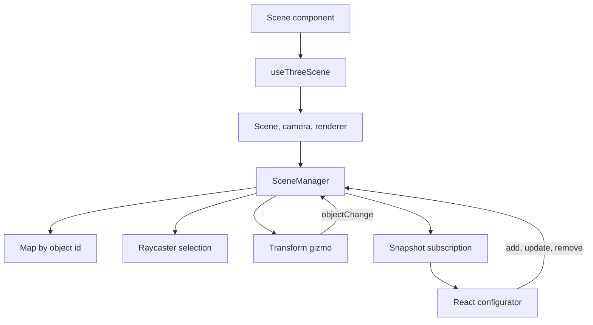

# Scene Manager Editor Plan

**Status:** In review. Development starts only after approval. Current GPT-5.5 role: planning only; implementation must be done by an allowed coding model per repo rules.

## Scope
- Add a vanilla three.js `SceneManager` that owns app objects, selection, transform gizmos, and cleanup.
- Add a default exported abstract `SceneObject` base class, inherited by generic shapes and specific shapes:
  - `SceneObject` -> `Cuboid` -> `Cube`, `Rectangle`, `Line`
  - `SceneObject` -> `Ellipsoid` -> `Sphere`, `Circle`, `Ellipse`, `Point`
  - `SceneObject` -> `Polygon`
- Add a React configurator UI for create/select/update/delete, color, position, rotation, size, and transform mode.
- Full editor behavior: click object on canvas to select, attach gizmo, drag translate/rotate/scale, disable orbit while dragging.
- In-memory only. No persistence/export/import in first pass.

## Existing Code To Reuse
- `src/hooks/useThreeScene.ts` already owns `THREE.Scene`, renderer, camera, RAF, resize, cleanup.
- `src/helpers/sceneControls.ts` already wraps `OrbitControls`; extend its handle so `TransformControls` can disable orbit while dragging.
- `src/helpers/camera.ts` already centralizes perspective/orthographic camera creation and resize projection.
- `src/components/Scene.tsx` already has the overlay controls panel and can host the object configurator.

## Architecture Decisions
- `SceneObject` will extend `THREE.Object3D` directly. It will not wrap a separate `object3D` property.
- Three's `position`, `rotation`, and `scale` remain the single source of truth. React snapshots read from those values instead of duplicating transform state.
- `SceneObject` handles shared metadata and behavior: `id`, `label`, `kind`, `userData.sceneObjectId`, transform updates, color updates, snapshots, and disposal.
- Color changes traverse child objects and update writable material colors. The base class will not store a constructor-level material array.
- `createGeometry()` belongs on mesh-based branches such as `Cuboid` and `Ellipsoid`, not on root `SceneObject`, because `Polygon` is a compound object with multiple child segments.

## File Plan
- Create `src/types/sceneObjects.ts`
  - Types: `SceneObjectId`, `SceneObjectKind`, `Vector3State`, `EulerState`, `SceneObjectTransform`, `SceneObjectConfig`, `SceneObjectUpdate`, `SceneObjectSnapshot`, `TransformMode`.
  - Keep UI and manager strictly typed around these contracts.
- Create `src/sceneObjects/SceneObject.ts`
  - Default abstract class extending `THREE.Object3D`.
  - Owns `id`, `label`, `kind`, transform/color setters, snapshot conversion, and resource disposal.
  - Uses `this.userData.sceneObjectId` and child tagging for raycast lookup.
- Create shape classes in `src/sceneObjects/`
  - `Cuboid.ts`, `Ellipsoid.ts`, `Cube.ts`, `Sphere.ts`, `Rectangle.ts`, `Circle.ts`, `Ellipse.ts`, `Point.ts`, `Line.ts`, `Polygon.ts`.
  - `Cuboid` and `Ellipsoid` expose protected `createGeometry()`/geometry replacement for mesh-based shapes.
  - Specific shapes configure size constraints and delegate common transforms/color/disposal to `SceneObject`.
- Create `src/sceneObjects/createSceneObject.ts`
  - Factory from `SceneObjectConfig` to subclass instance.
  - Central place for default dimensions/colors and IDs.
- Create `src/helpers/sceneResources.ts`
  - `disposeObject3D(object: Object3D): void` removes the object from its parent and traverses geometry/material resources, because Three removal does not free GPU resources automatically.
- Create `src/helpers/SceneManager.ts`
  - Owns `Map<SceneObjectId, SceneObject>` for O(1) updates/removes.
  - Methods: `addObject`, `updateObject`, `removeObject`, `selectObject`, `setTransformMode`, `getSnapshot`, `subscribe`, `dispose`.
  - Owns `Raycaster`, pointer handling, `TransformControls`, and emits snapshots to React on changes.
- Update `src/helpers/sceneControls.ts` and `src/types/sceneControls.ts`
  - Expose current enabled state and safe temporary disable/restore for transform dragging.
- Update `src/hooks/useThreeScene.ts`
  - Instantiate `SceneManager` after scene/camera/renderer/controls exist.
  - Return manager actions and snapshot state to React.
  - Dispose manager before renderer cleanup.
- Update `src/components/Scene.tsx`
  - Render object list, add buttons, delete button, transform mode controls, and selected-object configurator.
- Create `src/components/SceneObjectConfigurator.tsx`
  - Controlled inputs for selected object: color, position x/y/z, rotation x/y/z, size fields relevant to kind.
  - Calls manager update methods immediately on input change.
- Update `src/styles/global.css`
  - Expand the existing fixed panel styles for list/form layout without adding a CSS framework.

## Shape Behavior
- `Cuboid`: mesh-based base with `createGeometry(size)` returning `BoxGeometry(width, height, depth)`.
- `Cube`: Cuboid with equal dimensions; UI exposes one `size` value.
- `Rectangle`: Cuboid with `depth` fixed to a small thickness, rendered in XY plane.
- `Line`: Cuboid/rectangle segment with length and small thickness. First version uses position/rotation/size controls, not endpoint editing.
- `Ellipsoid`: mesh-based base with `createGeometry(size)` returning sphere-like geometry, then scale/radius constraints per subtype.
- `Sphere`: Ellipsoid with equal radii.
- `Circle`: Ellipsoid-derived flat disk using circular geometry; UI exposes radius.
- `Ellipse`: Ellipsoid-derived flat disk scaled x/y; UI exposes radiusX/radiusY.
- `Point`: small Sphere with default radius and bright default color.
- `Polygon`: group of connected `Line`-style segments from points. First version exposes predefined point count/vertices through config defaults, then transform/color/scale as a whole.

## Interaction Flow

## Implementation Order
1. Define strict types in `src/types/sceneObjects.ts`.
2. Add disposal helper in `src/helpers/sceneResources.ts`.
3. Refactor `SceneObject` to extend `THREE.Object3D` and remove wrapper-owned `object3D`/material-array state.
4. Add `SceneManager` with add/update/remove/select/snapshot only.
5. Wire `SceneManager` into `useThreeScene` and verify initial objects render.
6. Add raycast selection and `TransformControls` attach/detach, including orbit disable while dragging.
7. Add `SceneObjectConfigurator` and integrate it into `Scene.tsx`.
8. Update CSS for compact editor panel.
9. Verify with `pnpm build` and manual browser checks.

## Validation
- Run `pnpm build` for strict TypeScript and Vite build.
- Manual checks:
  - Add every shape type.
  - Select via object list and canvas click.
  - Change color/position/rotation/size from UI.
  - Drag with translate/rotate/scale gizmos.
  - Remove selected object and confirm gizmo detaches.
  - Toggle OrbitControls and confirm transform dragging temporarily disables orbit.
  - Add/remove repeatedly and check no obvious console errors.

## Risks / Constraints
- No automated test runner exists in the repo. First pass should not add test dependencies unless approved.
- `Polygon` endpoint editing is a likely follow-up; first pass manages it as a whole object.
- TransformControls can conflict with OrbitControls unless `dragging-changed` is handled carefully.
- Three resources must be explicitly disposed on remove and unmount.