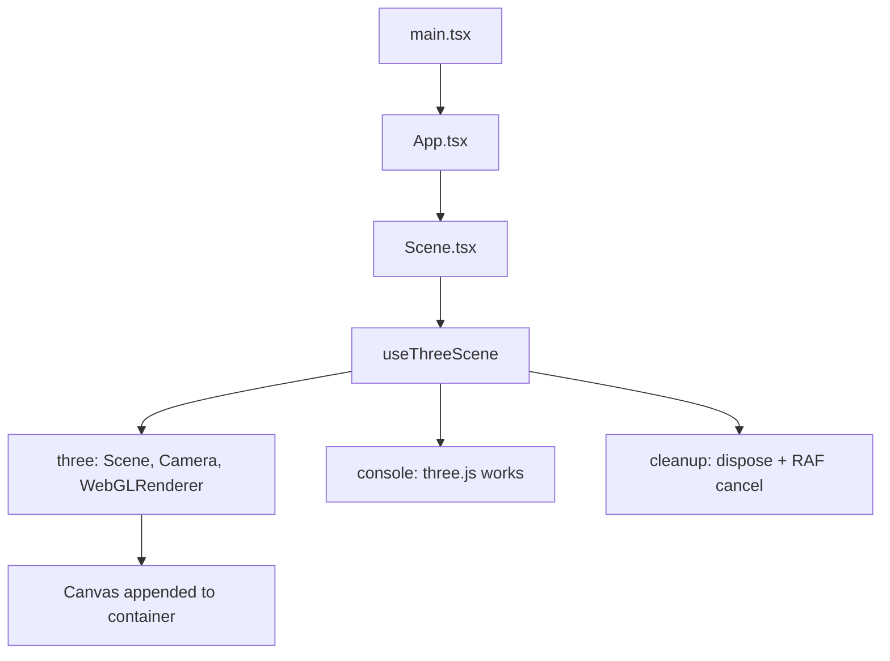

# three-test

Minimal **Vite + React + TypeScript + vanilla three.js** single-page app: an empty WebGL scene and console output that confirms React and three.js are wired correctly. No react-three-fiber—three is driven from a `useEffect` hook.

## Stack

| Piece                                                    | Role                                                                    |
| -------------------------------------------------------- | ----------------------------------------------------------------------- |
| **Vite** + `@vitejs/plugin-react`                        | Dev server and production build                                         |
| **React 18** + **react-dom**                             | UI shell                                                                |
| **TypeScript** (`strict`, `moduleResolution: "bundler"`) | Types                                                                   |
| **three**                                                | Scene, camera, `WebGLRenderer`                                          |
| **@types/three**                                         | Type packages aligned with three                                        |
| **pnpm**                                                 | Package manager (`pnpm-lock.yaml`; `packageManager` field for Corepack) |

No router, no CSS framework, no test runner—scope is intentionally tiny.

## Project layout

```
three-test/
  index.html
  package.json
  tsconfig.json
  tsconfig.app.json
  tsconfig.node.json
  vite.config.ts
  pnpm-lock.yaml
  public/
    vite.svg
  src/
    main.tsx                 # React root + "[boot] React works"
    App.tsx                  # Renders <Scene />
    components/
      Scene.tsx              # Container div + ref for the canvas
    hooks/
      useThreeScene.ts       # three.js lifecycle (create, RAF, resize, dispose)
    styles/
      global.css             # Full-viewport layout + dark background
    types/
      env.d.ts               # /// <reference types="vite/client" />
```

## How it works

React mounts `App` → `Scene` holds a `div`; `useThreeScene` runs in `useEffect`, appends the renderer’s canvas, clears to `#101014`, and logs `[boot] three.js works` with three’s `REVISION`. Cleanup removes listeners, cancels the animation frame, disposes the renderer, and removes the canvas (important under React 18 **StrictMode**, which mounts effects twice in development).



## Commands

Requires [pnpm](https://pnpm.io/installation) (this repo pins it via `packageManager` in `package.json` for Corepack).

```bash
pnpm install
pnpm dev
pnpm build
pnpm preview   # optional: serve production build locally
```

## Verification

1. Run `pnpm dev` and open the printed URL (default `http://localhost:5173/`).
2. Open the browser **Developer Tools → Console**.
3. You should see:
   - `[boot] React works`
   - `[boot] three.js works` with an object containing `revision` (three’s revision string).
4. The page should show a uniform dark viewport (`#101014`)—the empty scene’s clear color.

Under **StrictMode** in development, the three.js log may appear **twice**; that is expected after the effect re-runs.

`pnpm build` runs `tsc -b` then `vite build`; both must succeed for a clean strict TypeScript build.

## Out of scope (by design)

- No routing, global state, or UI kit
- No OrbitControls, meshes, or loaders
- No automated tests in this starter

For a larger app, extend `App.tsx` and add routes or state as needed.

## pnpm notes

- **Corepack:** `corepack enable` then `corepack prepare pnpm@10.20.0 --activate` matches the `packageManager` field in `package.json`.
- **Build-script warning:** On some pnpm versions you may see “Ignored build scripts: esbuild” after `pnpm install`. If `pnpm build` ever fails to find the native `esbuild` binary, run `pnpm approve-builds` once (or follow the prompt) so `esbuild` can run its install script.
