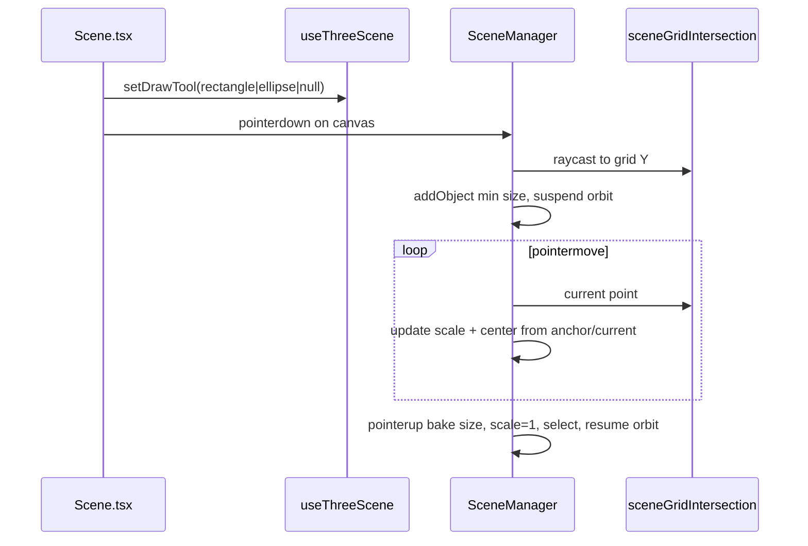

# Grid plane draw tools (rectangle & ellipse)

## Context

- **Existing shapes**: [`Rectangle.ts`](src/sceneObjects/Rectangle.ts) and [`Ellipse.ts`](src/sceneObjects/Ellipse.ts) already exist; factory + configurator size fields work.
- **Grid plane**: [`InfiniteGridHelper`](src/helpers/InfiniteGridHelper.ts) uses `PlaneGeometry` rotated `-π/2` on X at `y = DEFAULT_SCENE_GRID.yOffset` ([`sceneGrid.ts`](src/constants/sceneGrid.ts) → `yOffset: -0.001`). Drawing must raycast onto that **horizontal XZ plane** (`normal = (0,1,0)`, `y = yOffset`).
- **Orientation**: Rectangle/Ellipse meshes are thin in **local Z** (XY disk/plane). Lay them on the grid with `rotation.x = -Math.PI / 2` so local **X → world X**, local **Y → world Z**.
- **UI placement** (confirmed): new **Draw** section in [`Scene.tsx`](src/components/Scene.tsx), not [`SceneObjectConfigurator.tsx`](src/components/SceneObjectConfigurator.tsx) (configurator only shows when an object is selected).
- **Drag behavior** (confirmed): **corner-to-corner** — first click = anchor corner, drag = opposite corner.



## Architecture

| Layer | Responsibility |
|-------|----------------|
| [`sceneGrid.ts`](src/constants/sceneGrid.ts) | Export `SCENE_GRID_PLANE_Y` (alias of `yOffset`) for single source of truth |
| `src/utils/sceneGridIntersection.ts` | `pickPointOnSceneGridPlane(raycaster, pointer, camera, domElement, planeY)` → `Vector3 \| null` |
| `src/constants/sceneDraw.ts` | `MIN_RECT_WIDTH`, `MIN_RECT_HEIGHT`, `MIN_ELLIPSE_RADIUS_X/Y`, `FLAT_SHAPE_ROTATION_X` |
| `src/types/sceneDraw.ts` | `export type DrawTool = SceneObjectKind.Rectangle \| SceneObjectKind.Ellipse` |
| `src/helpers/ShapeDrawSession.ts` | Pure draw state machine (anchor, current id, bake math) — keeps [`SceneManager.ts`](src/helpers/SceneManager.ts) readable |
| `SceneManager` | Tool mode, pointer routing, orbit suspend, snapshot `activeDrawTool` |
| `Scene.tsx` | Toggle buttons + hint text when a draw tool is active |

## Draw interaction (corner-to-corner + scale preview)

**Constants** (new file, values tuned so geometry validators pass):

```ts
// sceneDraw.ts
export const MIN_RECT_WIDTH = 0.01;
export const MIN_RECT_HEIGHT = 0.01;
export const MIN_ELLIPSE_RADIUS_X = 0.01;
export const MIN_ELLIPSE_RADIUS_Y = 0.01;
export const FLAT_SHAPE_ROTATION_X = -Math.PI / 2;
```

**On pointer down** (left button, draw tool active, not `transformControls.dragging`):

1. Raycast grid plane; if miss → ignore.
2. `restoreOrbit = sceneControls.suspend()`.
3. `anchor` = hit point (XZ; use hit `y` or clamp to `SCENE_GRID_PLANE_Y`).
4. `addObject` with:
   - `kind`: active tool
   - `size`: minimum dimensions above
   - `transform.rotation.x = FLAT_SHAPE_ROTATION_X`, `scale: {1,1,1}`
5. Store `drawingObjectId`, attach `pointermove` / `pointerup` on `window`, `setPointerCapture` on `domElement`.
6. Do **not** attach transform gizmo yet.

**On pointer move** (while drawing):

Given `anchor` and `current` on the plane:

- `width = max(MIN_RECT_WIDTH, abs(current.x - anchor.x))`
- `depthOnGround = max(MIN_RECT_HEIGHT, abs(current.z - anchor.z))` (maps to rectangle `height` in local Y after rotation)
- `center = ((anchor.x + current.x) / 2, planeY + halfThickness, (anchor.z + current.z) / 2)`

For **rectangle** preview via **Object3D scale** (not geometry rebuild each frame):

- `scale.x = width / MIN_RECT_WIDTH`
- `scale.y = depthOnGround / MIN_RECT_HEIGHT` (local Y → world Z after rotation)
- `scale.z = 1`
- `position` = center (recomputed each move)

For **ellipse** (radii live on **mesh.scale** in [`Ellipsoid`](src/sceneObjects/Ellipsoid.ts); use **Object3D scale** only for preview):

- Base mesh radii = `MIN_ELLIPSE_RADIUS_*`
- `scale.x = (width / 2) / MIN_ELLIPSE_RADIUS_X`
- `scale.y = (depthOnGround / 2) / MIN_ELLIPSE_RADIUS_Y`
- Same center positioning as rectangle

**On pointer up**:

1. Read final `object.scale` and bake:
   - Rectangle: `finalWidth = MIN_RECT_WIDTH * scale.x`, `finalHeight = MIN_RECT_HEIGHT * scale.y`
   - Ellipse: `finalRadiusX = MIN_ELLIPSE_RADIUS_X * scale.x`, `finalRadiusY = MIN_ELLIPSE_RADIUS_Y * scale.y`
2. `object.scale.set(1, 1, 1)`
3. `updateObject(id, { size: { ... }, transform: { position: center } })` (position may already be correct; ensure baked)
4. `selectObject(id)` → transform gizmo attaches
5. Remove window listeners, `releasePointerCapture`, `restoreOrbit()`, clear drawing state
6. `emitSnapshot()` — **keep** `activeDrawTool` so user can draw again without re-clicking tool

**Pointer routing in `SceneManager.handlePointerDown`**:

```ts
if (activeDrawTool !== null && !transformControls.dragging) {
  startDraw(event); // consumes event
  return;
}
// existing object selection logic unchanged
```

While `drawingObjectId !== null`, ignore selection pointer events.

## Grid raycast utility

`src/utils/sceneGridIntersection.ts`:

- Reuse same NDC pointer math as [`SceneManager`](src/helpers/SceneManager.ts) lines 52–57.
- `new Plane(new Vector3(0, 1, 0), -planeY)` (Three.js plane constant = -normal·point).
- `raycaster.ray.intersectPlane(plane, target)` → return point or `null`.

Export `SCENE_GRID_PLANE_Y` from [`sceneGrid.ts`](src/constants/sceneGrid.ts):

```ts
export const SCENE_GRID_PLANE_Y = DEFAULT_SCENE_GRID.yOffset;
```

## Snapshot & hook API

Extend [`SceneEditorSnapshot`](src/types/scene-object/snapshot.ts):

```ts
readonly activeDrawTool: DrawTool | null;
```

[`useThreeScene.ts`](src/hooks/useThreeScene.ts):

- `setDrawTool(tool: DrawTool | null): void` → `SceneManager.setDrawTool`
- Default `activeDrawTool: null` in `EMPTY_EDITOR_SNAPSHOT`

## UI ([`Scene.tsx`](src/components/Scene.tsx))

New section **Draw** (below Gizmo or Add shape):

- Buttons: **Draw rect**, **Draw ellipse** (toggle; `aria-pressed` when active)
- Click active tool again → `setDrawTool(null)`
- Hint when tool active: e.g. “Click and drag on the grid to draw. Release to finish.”
- Optional: `cursor: crosshair` on `.scene-root` while tool active (CSS class on container)

## Edge cases

| Case | Behavior |
|------|----------|
| Drag < min distance | Keep minimum size; center still between anchor/current |
| Pointer up outside canvas | `pointerup` on `window` still finalizes |
| Orbit enabled during draw | Suspended for entire down→up gesture |
| Click without drag | Release with scale ≈ 1 → object stays at minimum size (valid) |
| Delete during draw | If needed later; v1: disallow or cancel session on `removeObject` of drawing id |

## Files to touch

| File | Action |
|------|--------|
| `src/constants/sceneGrid.ts` | Export `SCENE_GRID_PLANE_Y` |
| `src/constants/sceneDraw.ts` | **Create** min sizes + rotation |
| `src/types/sceneDraw.ts` | **Create** `DrawTool` |
| `src/utils/sceneGridIntersection.ts` | **Create** plane pick |
| `src/helpers/ShapeDrawSession.ts` | **Create** bake + layout math |
| `src/helpers/SceneManager.ts` | Draw tool state, pointer handlers, snapshot field |
| `src/types/scene-object/snapshot.ts` | `activeDrawTool` |
| `src/hooks/useThreeScene.ts` | `setDrawTool` |
| `src/components/Scene.tsx` | Draw section UI |

No changes to `Rectangle` / `Ellipse` classes unless bake math needs a package-private getter (prefer reading baked values from scale + constants, not new APIs).

## Verification (manual)

1. `pnpm dev` → enable **Draw rect** → drag on grid → rectangle appears flat on grid, grows with drag, gizmo works after release.
2. Same for **Draw ellipse**.
3. After release, configurator shows correct **Width/Height** or **Radius X/Y**, **Scale** all `1`.
4. Orbit does not rotate view during draw drag.
5. Without draw tool, click-to-select still works.

## Model workflow note

Per `AGENTS.md`: implementation should be done with **GPT 5.4** (3D/interaction); UI section in **Scene.tsx** can follow existing button patterns from the same file.
