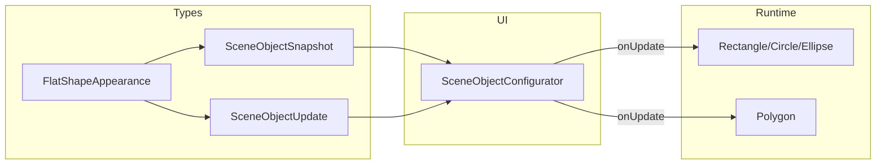

# 2D fill/outline transparency

## Current state

- All scene objects share one [`color`](c:/Projects/three-test/src/types/scene-object/snapshot.ts) hex field and [`SceneObject.setColor`](c:/Projects/three-test/src/sceneObjects/SceneObject.ts) walks every `MeshBasicMaterial`.
- **Rectangle / Circle / Ellipse**: single opaque fill mesh via [`Cuboid`](c:/Projects/three-test/src/sceneObjects/Cuboid.ts) / [`Ellipsoid`](c:/Projects/three-test/src/sceneObjects/Ellipsoid.ts) — no outline.
- **Polygon**: outline-only thick segment meshes ([`Polygon.ts`](c:/Projects/three-test/src/sceneObjects/Polygon.ts)) — no fill.
- **Cube / Sphere / Line / Point**: unchanged in this feature.
- UI: one color picker in [`SceneObjectConfigurator.tsx`](c:/Projects/three-test/src/components/SceneObjectConfigurator.tsx).

## Target behavior

| Kind | Fill | Outline | UI |
|------|------|---------|-----|
| Rectangle, Circle, Ellipse | colored mesh, opacity 0–1 | `LineLoop`, opacity 0–1 | fill + outline controls |
| Polygon | new `ShapeGeometry` fill (optional transparent) | existing segment meshes | fill + outline controls |
| Cube, Sphere, Line, Point | — | — | existing single Color |

**Outline-only look**: `fill.opacity = 0` (fill mesh hidden or fully transparent), `outline.opacity > 0`.



## Data model

**New file** [`src/types/scene-object/appearance.ts`](src/types/scene-object/appearance.ts):

```ts
export interface ColorAlpha {
  readonly color: number;   // 0xRRGGBB
  readonly opacity: number; // 0..1
}

export interface FlatShapeAppearance {
  readonly fill: ColorAlpha;
  readonly outline: ColorAlpha;
}

export const DEFAULT_FLAT_SHAPE_COLOR = 0x4a90d9;

export const DEFAULT_FLAT_APPEARANCE: FlatShapeAppearance = {
  fill: { color: DEFAULT_FLAT_SHAPE_COLOR, opacity: 1 },
  outline: { color: DEFAULT_FLAT_SHAPE_COLOR, opacity: 1 },
};
```

**Extend** [`config.ts`](c:/Projects/three-test/src/types/scene-object/config.ts), [`update.ts`](c:/Projects/three-test/src/types/scene-object/update.ts), [`snapshot.ts`](c:/Projects/three-test/src/types/scene-object/snapshot.ts):

- For `Rectangle | Circle | Ellipse | Polygon` variants only: add `appearance?: FlatShapeAppearance` (config) and `appearance: FlatShapeAppearance` (snapshot).
- Keep `color?` on config / `color` on 3D snapshots for Cube/Sphere/Line/Point.
- **2D snapshots**: drop top-level `color`; use `appearance` only (clean break — no persisted scenes in repo yet).
- `SceneObjectUpdate`: add `appearance?: Partial<FlatShapeAppearance> | { fill?: Partial<ColorAlpha>; outline?: Partial<ColorAlpha> }` (pick one shallow-merge style and document it).

**Helper** [`src/utils/flatShapeAppearance.ts`](src/utils/flatShapeAppearance.ts):

- `mergeFlatAppearance(base, patch): FlatShapeAppearance`
- `clampOpacity(n): number` → `[0, 1]`
- `appearanceFromLegacyColor(color: number): FlatShapeAppearance` for factory defaults when only `color` passed in config

Export types from [`src/types/scene-object/index.ts`](c:/Projects/three-test/src/types/scene-object/index.ts) and barrel [`sceneObjects.ts`](c:/Projects/three-test/src/types/sceneObjects.ts).

## Rendering utilities

**New file** [`src/utils/flatShapeMaterials.ts`](src/utils/flatShapeMaterials.ts):

```ts
export function applyColorAlpha(
  material: MeshBasicMaterial | LineBasicMaterial,
  { color, opacity }: ColorAlpha,
): void {
  material.color.setHex(color);
  material.opacity = clampOpacity(opacity);
  material.transparent = material.opacity < 1;
  // optional: depthWrite = material.opacity >= 1 for better stacking
}
```

**New file** [`src/utils/flatShapeOutline.ts`](src/utils/flatShapeOutline.ts) — pure geometry builders (local space, Z = 0 plane unless noted):

| Shape | Outline geometry |
|-------|------------------|
| Rectangle | 4-corner `BufferGeometry` + `LineLoop` |
| Circle | `EllipseCurve(0,0, radius, radius)` → points → `LineLoop` |
| Ellipse | same with `radiusX`, `radiusY` |
| Polygon | reuse vertex loop (closed) → `LineLoop` (segments can stay for hit area or be replaced later; **keep segment meshes for raycast/picking**, add `LineLoop` as visual outline OR drop duplicate by making segments use outline appearance only — prefer **one visual**: `LineLoop` for outline, keep thin segments only if needed for picking; simplest v1: **style existing segment meshes with outline appearance** and add separate `LineLoop` only for rect/circle/ellipse) |

For Polygon v1: **do not duplicate** — apply `outline` to segment materials; add **fill mesh** only.

**New file** [`src/helpers/FlatFilledShape.ts`](src/helpers/FlatFilledShape.ts) — abstract base for Rectangle/Circle/Ellipse:

- Owns `fillMesh: Mesh` + `outline: LineLoop`
- `protected applyAppearance(appearance: FlatShapeAppearance): void`
- `protected rebuildOutline(): void` (subclass implements dimensions)
- `getAppearance()` / `setAppearance(patch)`
- `dispose()` extends child disposal for line geometry/material
- Overrides `applyUpdate` to handle `appearance` before `super.applyUpdate` (which still handles transform/size/label; **remove color handling from base for these classes**)

Rectangle/Circle/Ellipse refactor:

- **Rectangle**: stop extending `Cuboid`; extend `FlatFilledShape` with `BoxGeometry` fill (same dimensions as today: `width × height × DEPTH`).
- **Circle / Ellipse**: stop extending `Ellipsoid`; extend `FlatFilledShape` with unit `SphereGeometry` + scale (same as [`Ellipsoid`](c:/Projects/three-test/src/sceneObjects/Ellipsoid.ts) today).
- Outline `LineLoop` sized to the **visible 2D footprint** (width/height or radii), not the thin depth edge.

## Polygon fill

In [`Polygon.ts`](c:/Projects/three-test/src/sceneObjects/Polygon.ts):

- Add `fillMesh` built from `THREE.Shape` + `ShapeGeometry` when `points.length >= 3`.
- `appearance.fill` drives fill material; `appearance.outline` drives segment materials.
- `opacity === 0`: skip fill mesh (or `fillMesh.visible = false`) to avoid useless draw calls.
- `rebuildSegments()` → rename to `rebuildGeometry()`; rebuild fill + segments on size change.
- `toSnapshot()` includes `appearance`.

## SceneObject base

[`SceneObject.ts`](c:/Projects/three-test/src/sceneObjects/SceneObject.ts):

- `applyUpdate`: keep `color` for 3D kinds only (no change for Cube/Sphere/Line/Point).
- 2D filled classes handle `appearance` themselves; do not rely on `traverseColorMaterial` for dual materials.

[`createSceneObject.ts`](c:/Projects/three-test/src/sceneObjects/createSceneObject.ts):

- Pass `appearance: config.appearance ?? appearanceFromLegacyColor(config.color ?? DEFAULT)` for 2D kinds.

## UI

[`SceneObjectConfigurator.tsx`](c:/Projects/three-test/src/components/SceneObjectConfigurator.tsx):

- If kind is Rectangle | Circle | Ellipse | Polygon:
  - **Fill**: color input + opacity range (`0`–`1`, step `0.01`)
  - **Outline**: color input + opacity range
  - Patch via `onUpdate({ appearance: { fill: { opacity: 0.5 } } })` etc.
- Else: existing single **Color** field bound to `snapshot.color`.

Reuse [`sceneEditorColor.ts`](c:/Projects/three-test/src/utils/sceneEditorColor.ts) for hex conversion.

Minor CSS in [`global.css`](c:/Projects/three-test/src/styles/global.css) only if needed (opacity slider row) — match existing `scene-editor-field` patterns.

## Files touched (parallel-friendly)

| Agent | Files |
|-------|--------|
| A | `appearance.ts`, `config.ts`, `update.ts`, `snapshot.ts`, `index.ts`, `flatShapeAppearance.ts` |
| B | `flatShapeMaterials.ts`, `flatShapeOutline.ts`, `FlatFilledShape.ts` |
| C | `Rectangle.ts`, `Circle.ts`, `Ellipse.ts` |
| D | `Polygon.ts` |
| E | `SceneObjectConfigurator.tsx`, optional `global.css` |
| F | `createSceneObject.ts`, `SceneObject.ts` (minimal) |

## Verification (manual)

1. Add Rectangle → set fill opacity `0`, outline opacity `1` → see border only.
2. Different fill vs outline colors on Circle/Ellipse.
3. Polygon with 3+ points: transparent fill, colored outline.
4. Cube/Sphere/Line/Point still show single Color; no regression.
5. Draw tool (Rectangle/Ellipse) still creates objects with default opaque fill+outline.
6. `npm run build` (or project typecheck script) passes.

## Out of scope

- Line / Point appearance split
- Configurable outline thickness (1px `LineLoop` per your choice)
- Persistence / import-export
- Test file changes (per AGENTS.md unless you approve)

## Status

**In review** — confirm plan to mark **Ready for development** and implement.
